:::tip

最近复习数据结构，又遇到「链表 LinkList」这个问题少年。

:::

## 链表简介

链表是一种常见的数据结构，用于存储和组织数据。它由一系列节点组成，每个节点包含两部分：数据域（存储数据）和指针域（指向下一个节点）。


### 链表与数组的区别

- 数组在随机访问、内存占用和空间效率方面具有优势，适合于需要快速访问元素和事先知道元素数量的情况。

- 链表在插入和删除操作上更加高效，适合于频繁的插入和删除操作以及不确定元素数量的情况。

| 特性            | 数组                             | 链表                               |
| --------------- | -------------------------------- | ---------------------------------- |
| 内存分配        | 连续的内存块                     | 非连续的内存块                     |
| 大小固定        | 是                               | 否                                 |
| 插入/删除       | 需要移动其他元素                 | 只需要修改指针                     |
| 访问速度        | O(1)                             | O(n)（需要遍历链表）               |
| 内存占用        | 固定大小，不受实际元素个数影响   | 动态分配，根据实际元素个数分配内存 |
| 内存管理        | 静态，由编译器或运行时分配和管理 | 动态，需要手动分配和释放内存       |
| 随机访问        | O(1)                             | 不支持，需要遍历链表               |
| 插入/删除复杂度 | O(n)（需要移动元素）             | O(1)（只需要修改指针）             |
| 空间效率        | 较高                             | 较低                               |


## 单链表的定义

**简单定义**

> 简单定义只是为了方便你理解，这你还不理解不了？😶

```c
// 结点结构体
struct node {
int data; // 数据域（存储数据）
struct node* next; // 指针域（存储结点指针）
};
```

解读：这段代码定义了一个名为 `node` 的结构体，它表示链表中的一个结点。

该结构体包含两个成员变量：

1. `int data`：用于存储结点中的数据。这里的 `data` 是一个整数类型的变量，可以根据实际需求进行修改。

2. `struct node* next`：用于指向下一个结点的指针。这里的 `next` 是一个指向 `struct node` 类型的指针，它指向链表中的下一个结点。


:::tip 扩展

来自[《结点和节点，到底怎么区分？》](https://blog.csdn.net/qq_42270373/article/details/83758928)有部分删改

要记住：一般算法中点的都是结点。**节点**被认为是一个实体，有处理能力，比如，网络上的一台计算机；而**结点**则只是一个交叉点，像“结绳记事”，打个结，做个标记。

:::


**一般定义**

> 通常在链表的定义中，为了健壮性，定义会稍微微复杂点。

```c
typedef int ElemType; // int 类型别名
typedef struct Node {
	ElemType data; // 数据域
	struct Node* next; // 指针域
} LinkNode; // 结点别名
```

这里为类型起别名是为了健壮性，暴露结构体内数据域的类型，更加方便地更改结点内的存储类型。

### 初始化

> 下面的头插法和尾插法已经包含了链表的初始化。这里拿出来简单理解。

```c
void InitList(LinkNode* L) {
    // 申请内存空间
	L = (LinkNode*)malloc(sizeof(LinkNode));
	// 单链表 尾结点设空
	L ->next = NULL;
}
```


### 头插法

```c {11-14}
void CreateListH(LinkNode* L, ElemType a[], int n) {
	LinkNode* s;
	// 申请内存空间
	L = (LinkNode*)malloc(sizeof(LinkNode));
	// 首将会变尾，将尾结点设空
	L ->next = NULL;
	for (int i = 0; i < n; i++) {
		s = (LinkNode*)malloc(sizeof(LinkNode));
		// 将数据放入s的数据域
		s ->data = a[i];
		// 将s插入首结点前
		s ->next = L ->next;
		// 将s插入头结点后
		L ->next = s;
	}
}
```

头插法的中心思想是以“头”为主，将所有新结点插入到头结点后，首结点前。



### 尾插法

```c {9-12}
void CreateListT(LinkNode* L, ElemType a[], int n) {
	LinkNode *s, *r;
	L = (LinkNode*)malloc(sizeof(LinkNode));
	// 暂时代替头结点
	r = L;
	for (int i = 0; i < n; i++) {
		s = (LinkNode*)malloc(sizeof(LinkNode));
		s ->data = a[i];
		// 将r指向s
		r ->next = s;
		// 将r代替s成为尾结点
		r = s;
	}
	// 最后，尾结点设空
	r ->next = NULL;
}
```

尾插法的中心思想是以“尾”为主，将所有新结点设为尾结点，不断向后插入。



### 链表的销毁


```c
void DestroyList(LinkNode* L) {
	LinkNode *ptr = L, *p = L ->next;
	while ( p != NULL) {
		free(ptr);
		ptr = p;
		p = ptr ->next;
	}
	free(ptr);
}
```

### 链表的遍历

链表的遍历（也叫链表的输出），中心思想是一直指向结点的指针域，判断是否有这个结点。

```c
void DispList(LinkNode *L) {
    // 代替头结点的指针域
	LinkNode *p = L ->next;
    // 判断头结点的指针域是否为空
	while (p != NULL) {
        // 输出数据域的数据
		printf("%d\n", p ->data);
        // 指向下一个结点的指针域
		p = p ->next;
	}
}
```

## 双链表的定义

> 双链表，无非是添加一个向前的指针域罢了。

```c
typedef int ElemType;
typedef struct Node{
	ElemType data; // 数据域
	struct Node* prior; // 前指针域 
	struct Node* next; // 后指针域
}LinkNode;
```

### 初始化

> 下面的头插法和尾插法已经包含了链表的初始化。这里拿出来简单理解。

```c
void InitList(LinkList &L){
    // 申请内存空间
    L = (Node *)malloc(sizeof(LinkList));
    // 双链表 前指针域设空
    L->prior = NULL;
    // 双链表 后指针域设空
    L->next = NULL;
}
```


### 头插法


```c {9-12}
void CreateListH(LinkNode* L, ElemType a[], int n){
    
	LinkNode* s;
	L = (LinkNode*)malloc(sizeof(LinkNode));
	L ->prior = L ->next = NULL;
	for(int i=0;i<n;i++){
		s = (LinkNode*)malloc(sizeof(LinkNode));
		s ->data = a[i];
		s ->next = L ->next;
		if(L ->next!= NULL) L ->next ->prior = s;
		L ->next = s;
		s ->prior = L;
	}
}
```


### 尾插法

```c {8-10}
void CreateListT(LinkNode* L, ElemType a[], int n){
	LinkNode* s, *r;
	L = (LinkNode*)malloc(sizeof(LinkNode));
	r = L;
	for(int i=0;i<n;i++){
		s = (LinkNode*)malloc(sizeof(LinkNode));
		s ->data = a[i];
		r ->next = s;
		s ->prior = r;
		r = s;
	}
	r ->next = NULL;
}
```


## 循环链表

> 循环链表对于单链表而言，只是将尾结点指向头结点，形成闭环。其他用法基本相同。

### 初始化

```c
//初始化单链表
void InitList(LinkNode* L) {
	L = (LinkNode*)malloc(sizeof(LinkNode));
	//循环链表，指针域为头结点
	L ->next = L;
}
```

## 最后说一下

> 学一下吧，还是有点用的🧐。

链表是数据结构是最重要的结构之一，栈，队，树等基本都是基于它构建的。
