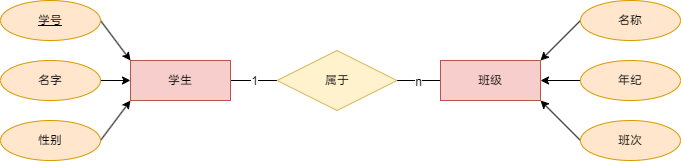
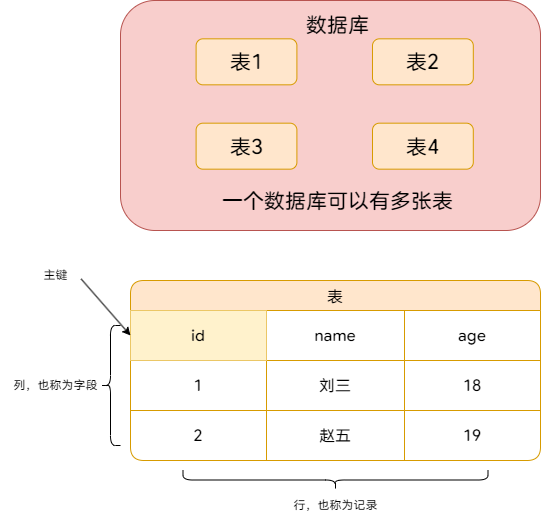

# 数据库（简洁版）

## 数据库的基本概念

> 最近同学要学数据库，我就加急赶了一份入门教程，也算是能看，就放这吧。😎

### 什么是数据库

- 数据库（database）是用来组织、存储和管理数据的仓库
- 当今世界是 个充满着数据的互联网世界，充着大量的数据。除了文本类型的数据，图像、音乐、声音都是数据。
- 为了方便管理互联网世界中的数据，就有了数据库管理系统的概念（简称：数据库）。用户可以对数据库中的数据进行新增、查询、更新、删除等操作

### 常见的数据库及分类

市面上的数据库有很多种，最常见的数据库有如下几个

1. MySQL 数据库（免费）
2. Oracle 数据库（收费）
3. SQLServer 数据库（收费）
4. Mongodb 数据库（免费）

- 其中，MySQL、Oracle、SQLServer 属于传统型数据库（又叫做：关系型数据库或 SQL 数据库），这三者的设计理念相同，用法比较类似

- 而 Mongodb 属于新型数据库（又叫做：非关系型数据库或 NoSQL 数据库），它在一定程度上弥补了传统型数据库的缺陷。


## 信息世界

| 概念     | 描述                                                   |
| -------- | ------------------------------------------------------ |
| 实体     | 一个独立的对象或概念                                   |
| 实体型   | 对实体的描述                                           |
| 实体集   | 实体的集合                                             |
| 属性     | 实体的特性                                             |
| 码       | 可唯一标识实体的属性集                                 |
| 候选码   | 可唯一标识某一元组的属性组，属性组中各个属性缺一不可。 |
| 超码     | 只要可以唯一标识一个元组，那么这个属性组是超码         |
| 全码     | 极端情况下表的所有属性组成该表的候选码，则称为全码     |
| 主码     | 候选码中选出一个唯一标识元组的属性                     |
| 外码     | 与其他表主码联系的属性                                 |
| 主属性   | 候选码中的属性称为主属性                               |
| 非主属性 | 不是主属性的属性                                       |
| 域       | 属性的取值范围                                         |
| 联系     | 实体集之间的关系：<br />一对一<br />一对多<br />多对多 |


### E-R 图

有三个组成部分: 实体、属性、联系。用来进行关系型数据库系统的概念设计。

- 实体：矩形
- 属性：椭圆
- 联系：菱形





### 什么是关系型数据库？

- 关系型数据库是依据关系模型来创建的数据库。
- 关系模型就是指二维表格模型,因而一个关系型数据库就是由二维表及其之间的联系组成的一个数据组织。
- 关系型数据可以很好地存储一些关系模型的数据
- 关系模型是我们生活中能经常遇见的模型，存储这类数据一般用关系型数据库


### 关系模型

关系模式是关系型数据库中表的结构定义，它由表名、列名和列的数据类型组成。关系模式定义了表的结构和属性，以及表之间的关系。

关系模式可以形式化地表示为 如：同学（学号，姓名，性别，年龄，班级）

R（U）或 R(A1，A2...,An）

- R:关系名
- A1，A2，An：属性名


## 数据库


### 数据库术语



| 术语                    | 描述                                                         |
| ----------------------- | ------------------------------------------------------------ |
| 数据库（database）      | 由一个或多个表组成，每个表包含多个行和列。                   |
| 数据表（table）         | 是由一个或多个列组成的。                                     |
| 列（column）            | 表中的一列称为字段。                                         |
| 行（row）               | 表中的一行称为元组。                                         |
| 键（key）               | 用于唯一标识数据库表中的记录（行）的一列或一组列。           |
| 主键（primary key）     | 一列（或一组列），其值能够唯一标识表中每一行。               |
| 候选键（candidate key） | 一列（或一组列），候选键都具备键的特征，都有资格成为主键。   |
| 超键（super key）       | 包含键的字段集合，无需保证字段集的最小化。每个键也是超键。可以认为是键的超集。 |
| 依赖（relation）        | 字段间存在的某种联系。                                       |


### 函数依赖

如果确定一个表中的某个数据（A），则就可以确定该表中的其他另一个数据（B）

- 记 A->B 表示 A 函数决定 B，也可以说 B 函数依赖于 A。

- 对于 A->B，如果能找到 A 的真子集 A'，使得 A'-> B，那么 A->B 就是部分函数依赖，否则就是完全函数依赖。

- 对于 A->B，B->C，则 A->C 是一个传递函数依赖。


### 范式

高级别范式的依赖于低级别的范式，1NF 是最低级别的范式。现代数据库一般遵守 `1NF-BCNF`，4NF 和 5NF 是理论范式。 


#### 第一范式 (1NF)

属于第一范式关系的所有属性都不可再分，即数据项不可分。

理解：第一范式强调数据表的**原子性**，是其他范式的基础。

#### 第二范式 (2NF)

在第一范式的基础上，任何非主属性完全函数依赖于任何一个候选键

理解：第二范式保证数据表的每一行数据具有**唯一性**，并不能有部分依赖关系。

| Sno  | Sname  | Sdept  | Mname  | Cname  | Grade |
| :--: | :----: | :----: | :----: | :----: | :---: |
|  1   | 学生-1 | 学院-1 | 院长-1 | 课程-1 |  90   |
|  2   | 学生-2 | 学院-2 | 院长-2 | 课程-2 |  80   |
|  2   | 学生-2 | 学院-2 | 院长-2 | 课程-1 |  100  |
|  3   | 学生-3 | 学院-2 | 院长-2 | 课程-2 |  95   |

以上学生课程关系中，{Sno, Cname} 为键码，有如下函数依赖:

- Sno -> Sname, Sdept
- Sdept -> Mname
- Sno, Cname-> Grade

Grade 完全函数依赖于键码，Sname, Sdept 和 Mname 都部分依赖于键码


#### **基于第二范式**

表一

| Sno  | Sname  | Sdept  | Mname  |
| :--: | :----: | :----: | :----: |
|  1   | 学生-1 | 学院-1 | 院长-1 |
|  2   | 学生-2 | 学院-2 | 院长-2 |
|  3   | 学生-3 | 学院-2 | 院长-2 |

有以下函数依赖:

- Sno -> Sname, Sdept
- Sdept -> Mname


表二

| Sno  | Cname  | Grade |
| :--: | :----: | :---: |
|  1   | 课程-1 |  90   |
|  2   | 课程-2 |  80   |
|  2   | 课程-1 |  100  |
|  3   | 课程-2 |  95   |

有以下函数依赖:

- Sno, Cname -> Grade


#### 第三范式 (3NF)

在第二范式的基础上，任何非主属性不传递函数依赖于键码

理解：第二范式保证数据表的非主属性**独立性**，非主属性不依赖于另一个非主属性。


表一存在传递依赖：

- Sno -> Sdept -> Mname


**基于第三范式**

表三

| Sno  | Sname  | Sdept  |
| :--: | :----: | :----: |
|  1   | 学生-1 | 学院-1 |
|  2   | 学生-2 | 学院-2 |
|  3   | 学生-3 | 学院-2 |

表四

| Sdept  | Mname  |
| :----: | :----: |
| 学院-1 | 院长-1 |
| 学院-2 | 院长-2 |


## SQL语句

### 什么是 SQL

SQL（英文全称：Structured Query Language）是结构化查询语言，专门用来访问和处理数据库的编程语言。能够让我们以编程的形式，操作数据库里面的数据

- SQL 是一门数据库编程语言
- 使用 SQL 语言编写出来的代码，叫做 SQL 语句
- SQL 语言只能在关系型数据库中使用。
- SQL 不区分大小写，建议 SQL 语句大写，避免歧义。


### 核心动词

| 数据定义             | 数据查询（重点）     | 数据操纵             | 数据控制（了解）     |
| -------------------- | -------------------- | -------------------- | -------------------- |
| CREATE -create(创建) | SELECT -select(查询) | INSERT -insert(插入) | CRANT -crant(授权)   |
| DROP -drop(删除)     |                      | UPDATE -update(更新) | REVOKE -revoke(收回) |
| ALTER -alter(修改)   |                      | DELETE -delete(删除) |                      |


### SQL 常用数据类型

|   分类   |       类型名        | 说明                                                         |
| :------: | :-----------------: | :----------------------------------------------------------- |
|  字符型  | char(n)；varchar(n) | char（固定长度）可以存储字符集中的任意字符组合， 按长度 n 存储；varchar（可变长度）允许字符长度变化，最大不超过 n，按实际长度存储，能够自动删除后续的空格 |
|   整型   |    smallint；int    | 都可表示整数，smallint 短整型比 int 整形的取值范围和所占字节数更小 |
|  小数型  |     float；real     | 都可表示小数，float 单精度比 real 双精度的取值范围和所占字节数更小 |
| 日期时间 |   date；datetime    | data 表示年月日，datatime 表示年月日时分秒                   |
|  二进制  |      binary(n)      | 以十六进制存储二进制字符串                                   |


### SQL 完整性约束条件

|  约束条件   |      含义      | 用法                                                         |
| :---------: | :------------: | ------------------------------------------------------------ |
| primary key |      主码      | 列名 类型 primary key(列级约束条件)；primary key(列名 1，列名 2，...)(表级约束条件) |
|   unique    | 值唯一，不重复 | 列名 类型 unique(列级约束条件)；unique(列名 1，列名 2，...)(表级约束条件) |
| foreign key |     设外码     | foreign(本列列名)references 外表名(外表主码)                 |
|  not null   |     不为空     | 列名 类型 not null                                           |
|   default   |     默认值     | 列名 类型 default 默认值                                     |
|    check    |    取值范围    | 列名 类型 check(列名的约束条件)                              |


### SQL 语句的基础使用

#### SQL 的数据库语句

**创建数据库**


```sql
CREATE DATABASE 数据库名

-- 示例
CREATE DATABASE mydb
```

**删除数据库**

```sql
DROP DATABASE 数据库名

-- 示例
DROP DATABASE mydb
```


#### SQL 的表语句

**创建基础表**

```sql
CREATE TABLE 表名(
    列名 数据类型[列级约束条件]，
    列名 数据类型[列级约束条件]，
    [,表级约束条件]
)

-- 示例
CREATE TABLE mytb(
    id INT NOT NULL,
    name VARCHAR(255) NOT NULL,
    age INT NOT NULL,
    PRIMARY KEY (id)
    -- id 字段为此表的主键
)
```


**修改基础表**

- `restrict`：表示在基本表删除列时，所有引用此列的视图或约束也被自动删除
- `cascade`：默认方式，表示在没有视图或约束引用到该属性列时，才能在基本表中删除该列，否则拒绝删除操作

```sql
ALTER TABLE 表名[ADD 新列名 数据类型[列级约束条件]]
						 [DROP COLUMN 列名[restrict|cascade]]
						 [MODIFY 列名 新数据类型]
						 
-- 示例
ALTER TABLE mytb ADD sex VARCHAR(255) NOT NULL
ALTER TABLE mytb DROP COLUMN sex
ALTER TABLE mytb MODIFY sex CHAR(255)
```


**删除基本表**

```sql
DROP TABLE 表名

-- 示例
DROP TABLE mytb
```


#### SQL 的查询语句

SELECT 用于从表中查询数据。执行的结果被存储在一个结果表中（称为结果集）。

> 注意：SQL 语句中的关键字对大小写不敏感。SELECT 等效于 select，FROM 等效于 from。

```sql
-- 这是注释
-- 从FROM指定的表中，查询出所有的数据。* 通配符，表示所有
SELECT * FROM 表名称
-- 从FROM指定的表中，查询出指定列名称（字段）的数据。
SELECT 列名称 FROM 表名称


-- 示例
SELECT * FROM mytb
SELECT name FROM mytb
```


#### SQL 的插入语句

INSERTINTO 用于向数据表中插入新的数据行。

> 注意：列和值要一一对应，多个列和多个值之间，使用英文的逗号分隔

```sql
-- 语法解读：向指定的表中，插入如下几列数据，列的值通过values

INSERT INTO 表名称 (列1, 列2...) VALUES (值1, 值2...)

-- 示例
INSERT INTO mytb (id, name,age) VALUES (1,"刘三",18)
```


#### SQL 的更新语句

Update 用于修改表中的数据。

```sql
-- 语法解读：
-- 1.用UPDATE指定要更新哪个表中的数据
-- 2.用SET指定列对应的新值
-- 3.用WHERE指定更新的条件
UPDATE 表名称 SET 列名称 = 新值 WHERE 列名称 = 某值

-- 示例
UPDATE mytb SET name = "赵四" WHERE id = 1
```


#### SQL 的删除语句

DELETE 用于删除表中的行。

```sql
-- 语法解读：从指定的表中，根据WHERE条件，删除对应的数据行
DELETE FROM 表名称 WHERE 列名称 = 值

-- 示例
DELETE FROM mytb WHERE id = 1
```


#### SQL 的 WHERE 子句

WHERE 子句用于限定选择的条件。在 SELECT、UPDATE、DELETE 语句中，皆可使用 WHERE 子句来限定选择的条件。

```sql
-- 查询语句中的WHERE条件
SELECT 列名称 FROM 表名称 WHERE 列 运算符 值
-- 更新语句中的WHERE条件
UPDATE 表名称 SET 列=新值 WHERE 列 运算符 值
-- 删除语句中的WHERE条件
DELETE FROM 表名称 WHERE 列 运算符 值

-- 示例
SELECT name FROM mytb WHERE id = 1
UPDATE mytb SET name = '赵四' WHERE id = 1
DELETE FROM mytb WHERE id = 1
```

##### 可在 WHERE 子句中使用的运算符

下面的运算符可在 WHERE 子句中使用，用来限定选择的标准

> 注意：在某些版本的 SQL 中，操作符`<>`可以写成`!=`

| 操作符  |     描述     |
| :-----: | :----------: |
|    =    |     等于     |
|   <>    |    不等于    |
|    >    |     大于     |
|    <    |     小于     |
|   >=    |   大于等于   |
|   <=    |   小于等于   |
| BETWEEN | 在某个范围内 |
|  LIKE   |  索某种模式  |


**SQL 的 AND 和 OR 运算符**

- AND 和 OR 可在 WHERE 子语句中把两个或多个条件结合起来
- AND 表示必须同时满足多个条件，相当于 Python 中的 and
- OR 示只要满足任意一个条件即可，相当 Python 中的 or


#### SQL 的 ORDER BY 子句

- ORDERBY 语句用于根据指定的列对结果集进行排序。
- ORDERBY 语句默认按照升序对记录进行排序（关键字 ASC 可以不写）
- 如果您希望按照降序对记录进行排序，可以使用 DESC 关键字


**ORDERBY 子句-多重排序**

对表中的数据，先按照字段进行降序排序，再按照其他字段顺序，进行升序排序

```sql
SELECT * FROM 表名称 ORDER BY 列 DESC, 列 ASC

-- 示例
SELECT * FROM mytb ORDER BY id DESC, age ASC
```


#### SQL 的 COUNT(*)函数

COUNT(*)函数用于返回查询结果的总数据条数，语法格式如下：

```sql
SELECT COUNT(*) FROM 表名称

-- 示例
SELECT COUNT(*) FROM mytb
```


**使用 AS 为列设置别名**

如果希望给查询出来的列名称设置别名，可以使用 AS 关键字，示例如下

```sql
SELECT COUNT(*) AS 新名 FROM 表 WHERE 列 = 值

-- 示例
SELECT COUNT(*) AS ID FROM mytb WHERE id = 1
```
